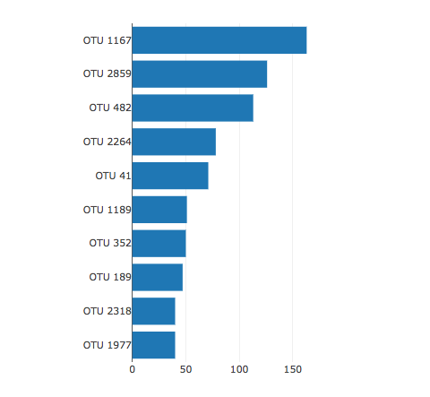
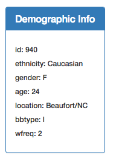
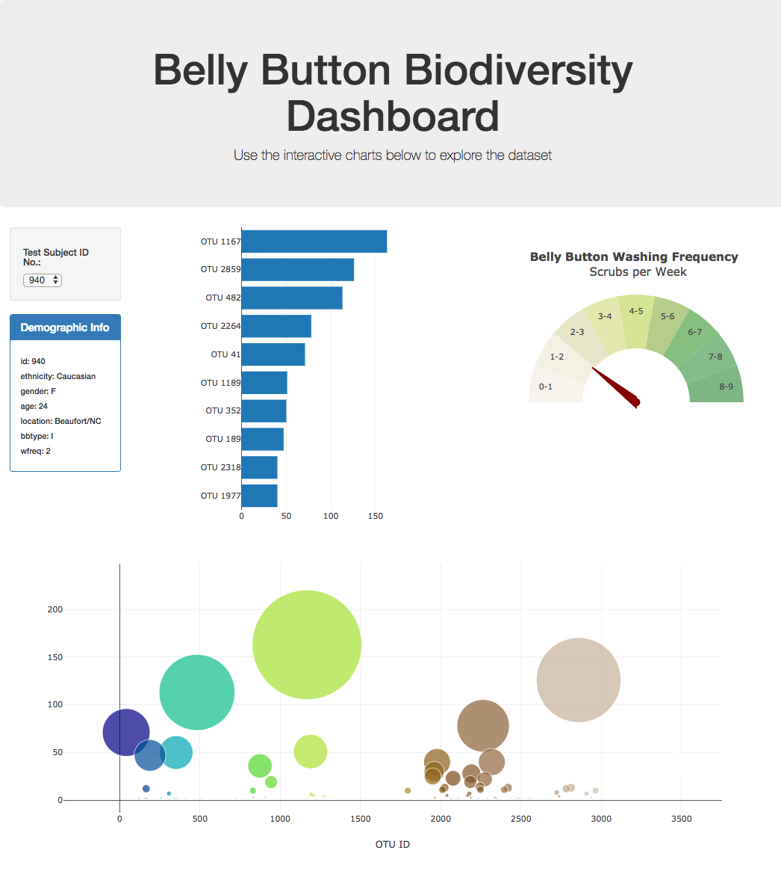

# BellyButtonChallenge
We begin our code ill at ease with deadlines approaching and no mentor sessions scheduled in time, although I still have askBCS and online resources to help guide me.
Took the bonus script out because it was causing errors for me, storing here, repost back in line 51.   

Things have gone well with looking at week 14 examples but I have had issues with referencing the correct datasets sometimes. ChatGPT really helps here as I plug my code and it helps spot inconsistenties in my writing.

I've managed to create the neccessary graphs but they are rough and I need to schedule either a tutoring session or askBCS to help clean it up and make it presentable. We are aiming for an A after all.

Slightly more progress and things are looking nicer as well. There seems to be some sort of issue where the data on the graphs appear off compared to the example pictures. I will need to look further into this with help to locate the issue. Overall we are feeling very good about this so far.

Instructions
Complete the following steps:

Use the D3 library to read in samples.json from the URL https://2u-data-curriculum-team.s3.amazonaws.com/dataviz-classroom/v1.1/14-Interactive-Web-Visualizations/02-Homework/samples.json.

Create a horizontal bar chart with a dropdown menu to display the top 10 OTUs found in that individual.

Use sample_values as the values for the bar chart.

Use otu_ids as the labels for the bar chart.

Use otu_labels as the hovertext for the chart.

Create a bubble chart that displays each sample.

Use otu_ids for the x values.

Use sample_values for the y values.

Use sample_values for the marker size.

Use otu_ids for the marker colors.

Use otu_labels for the text values.

Display the sample metadata, i.e., an individual's demographic information.

Display each key-value pair from the metadata JSON object somewhere on the page.

Update all the plots when a new sample is selected. Additionally, you are welcome to create any layout that you would like for your dashboard. An example dashboard is shown as follows:

Deploy your app to a free static page hosting service, such as GitHub Pages. Submit the links to your deployment and your GitHub repo. Ensure that your repository has regular commits and a thorough README.md file

Advanced Challenge Assignment (Optional with no extra points earning)
The following task is advanced and therefore optional.

Adapt the Gauge Chart from https://plot.ly/javascript/gauge-charts/Links to an external site. to plot the weekly washing frequency of the individual.

You will need to modify the example gauge code to account for values ranging from 0 through 9.

Update the chart whenever a new sample is selected.

Weekly Washing Frequency Gauge

Hints
Use console.log inside of your JavaScript code to see what your data looks like at each step.

Refer to the Plotly.js documentationLinks to an external site. when building the plots.

Requirements
Bar Chart (30 points)
Chart initializes without error (10 points)

Chart updates when a new sample is selected (5 points)

Chart uses Top 10 sample values as values (5 points)

Chart uses otu_ids as the labels (5 points)

Chart uses otu_labels as the tooltip (5 points)

Bubble Charts (40 points)
Chart initializes without error (10 points)

Chart updates when a new sample is selected (5 points)

Chart uses otu_ids for the x values (5 points)

Chart uses otu_ids for marker colors (5 points)

Chart uses sample_values for the y values (5 points)

Chart uses sample_values for the marker size (5 points)

Chart uses `otu_labels for text values (5 points)

Metadata and Deployment (30 points)
Metadata initializes without error (10 points)

Metadata updates when a new sample is selected (10 points)

App Successfully Deployed to Github Pages (10 points)